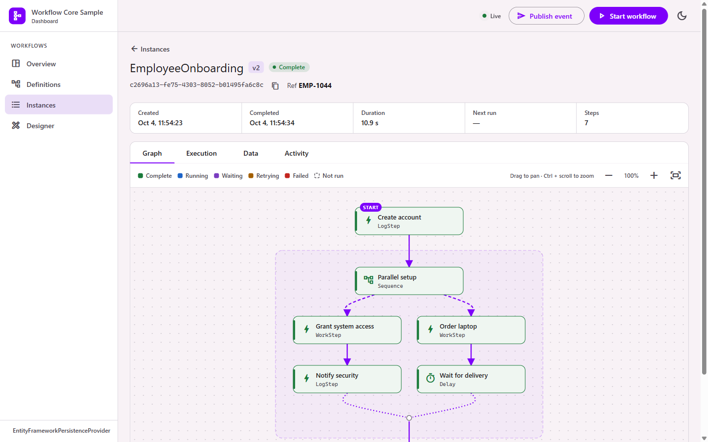

<p align="center">
  
</p>

<h1 align="center">Workflow Core Dashboard</h1>

<p align="center">
  Monitor, inspect and design <a href="https://github.com/danielgerlag/workflow-core">Workflow Core</a> workflows from your browser.<br />
  An embeddable dashboard for ASP.NET Core, in the spirit of Elsa Studio.
</p>

<p align="center">
  <a href="https://github.com/inferenceailab/WorkflowCore.Dashboard/actions/workflows/ci.yml"></a>
  <a href="https://github.com/inferenceailab/WorkflowCore.Dashboard/actions/workflows/codeql.yml"></a>
  <a href="LICENSE"></a>
  
</p>


## Features

- **Live overview**: lifecycle events as they happen, with totals for the last hour, day or week.
- **Instances**: newest first with totals; filter by status, definition and date, or open one by ID.
- **Instance view**: a flowchart with each step's state and the paths actually taken, plus a step timeline, workflow data, payloads and error stack traces.
- **Control**: start, suspend, resume and terminate workflows, and publish events.
- **Activity history**: kept in your database (any EF Core relational provider), surviving restarts.
- **Designer**: build and edit JSON/YAML workflows visually, then publish them as new versions.
- **Every persistence provider**: built only on Workflow Core's own abstractions.
- **Sign-in with your identity provider**: Okta, Microsoft Entra ID, Auth0, Keycloak, Google, Amazon Cognito or any OpenID Connect provider, with admin and viewer roles.
- **Secure by default**: local requests only until you configure sign-in, CSRF and clickjacking protection, optional read-only mode.

| Instance flowchart | Designer |
|---|---|
|  |  |

## Quick start

```csharp
builder.Services.AddWorkflow();                    // your Workflow Core setup
builder.Services.AddWorkflowCoreDashboard();

var app = builder.Build();
app.MapWorkflowCoreDashboard("/workflows");
```

Run the app and open `/workflows` from the same machine. For history that survives restarts, the designer, and access from other machines, see [Getting started](docs/Getting-Started.md).

### Packages

| Package | Adds |
|---|---|
| `WorkflowCore.Dashboard` | The UI, its API and live updates; activity kept in memory |
| `WorkflowCore.Dashboard.EntityFramework` | Activity history and instance index in SQL Server, PostgreSQL, MySQL, SQLite or Oracle |
| `WorkflowCore.Dashboard.Designer` | The visual designer for JSON/YAML workflows |
| `WorkflowCore.Dashboard.OpenIdConnect` | Sign-in with Okta, Entra ID, Auth0, Keycloak, Google, Cognito or any OpenID Connect provider |

Packages are attached to each [GitHub release](https://github.com/inferenceailab/WorkflowCore.Dashboard/releases). They run on .NET 8, 9 and 10.

### Try the sample

```bash
git clone https://github.com/inferenceailab/WorkflowCore.Dashboard.git
cd WorkflowCore.Dashboard
dotnet run --project samples/WorkflowCore.Dashboard.Sample
```

Open http://localhost:5290/workflows. The sample runs C#, JSON and YAML workflows on SQLite and starts new ones every few seconds. Building needs the .NET 10 SDK and Node.js 22.22+ or 24.15+.

## Documentation

| | |
|---|---|
| [Getting started](docs/Getting-Started.md) | Install, configure, first run |
| [Configuration](docs/Configuration.md) | Every option of the dashboard, journal and designer |
| [Security](docs/Security.md) | Exposing the dashboard safely; threat model |
| [Identity providers](docs/Identity-Providers.md) | Sign-in with Okta, Entra ID, Auth0, Keycloak, Google, Cognito and others |
| [Activity journal](docs/Activity-Journal.md) | History, instance index, retention, several nodes |
| [Workflow graph](docs/Workflow-Graph.md) | How flowcharts are drawn and colored |
| [Designer](docs/Designer.md) | Building, validating and publishing workflows |
| [REST API](docs/REST-API.md) | Endpoints behind the UI |
| [Architecture](docs/Architecture.md) | How the pieces fit together |
| [Development](docs/Development.md) | Building, testing and releasing |
| [FAQ](docs/FAQ.md) | Common questions and problems |

The same pages are published to the [wiki](https://github.com/inferenceailab/WorkflowCore.Dashboard/wiki).

## Contributing

Bug reports, ideas and pull requests are welcome. Read [CONTRIBUTING.md](CONTRIBUTING.md) first, and follow the [code of conduct](CODE_OF_CONDUCT.md).

Found a vulnerability? Please report it privately as described in [SECURITY.md](SECURITY.md), not in an issue.

## License

[MIT](LICENSE). Workflow Core is a separate project by Daniel Gerlag, also under the MIT license.
