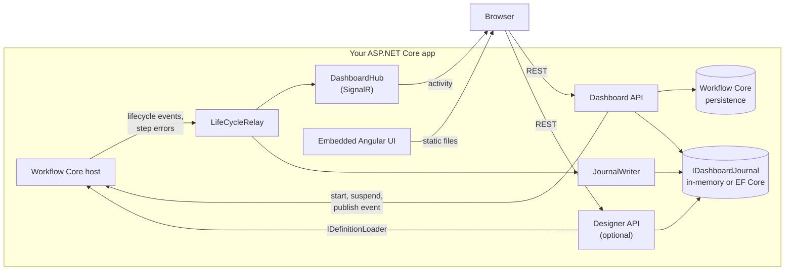

# Architecture

## Packages

| Package | Contents | Depends on |
|---|---|---|
| `WorkflowCore.Dashboard` | API, SignalR hub, relay, in-memory journal, embedded UI | WorkflowCore, ASP.NET Core |
| `WorkflowCore.Dashboard.EntityFramework` | EF Core journal | the above, EF Core Relational 8+ |
| `WorkflowCore.Dashboard.Designer` | Designer API, step catalog, validation, sync | the above, WorkflowCore.DSL |

Optional packages plug in through `DashboardBuilder` (`UseJournal`) and `IDashboardExtension` (extra API endpoints and a feature flag for the UI).

## Request path

`MapWorkflowCoreDashboard` creates one route group:

1. **Authorization filter** (whole group): sets security headers and applies `DashboardOptions.Authorization`.
2. **Change filter** (`/api`): POST, PUT and DELETE need the `X-Wfc-Dashboard` header, no `Sec-Fetch-Site: cross-site`, and `AllowActions`.
3. **Endpoints**: dashboard API, extension endpoints, the hub, and the UI with fallback to `index.html`, whose `<base href>` is rewritten to the mount path.

## Event path

1. Workflow Core raises a lifecycle event; `LifeCycleRelay` subscribes through `IWorkflowHost.OnLifeCycleEvent` and `OnStepError`.
2. The relay builds an `ActivityEntry` with a deterministic ID, joins error events with their exception, and resolves step names from the registry.
3. The entry goes to all hub clients at once, and to `JournalWriter`, which batches writes off the workflow path.
4. The journal stores the entry once and updates the instance index (`InstanceIndexReducer` turns events into status changes, tolerating out-of-order arrival).

## UI

Angular 22 with Angular Material, standalone components and signals. `npm run build` writes into `src/WorkflowCore.Dashboard/wwwroot`, which is embedded in the assembly and served by `EmbeddedUi` with long-lived caching for hashed files. Flowcharts are SVG laid out with dagre; the designer canvas is SVG as well.
