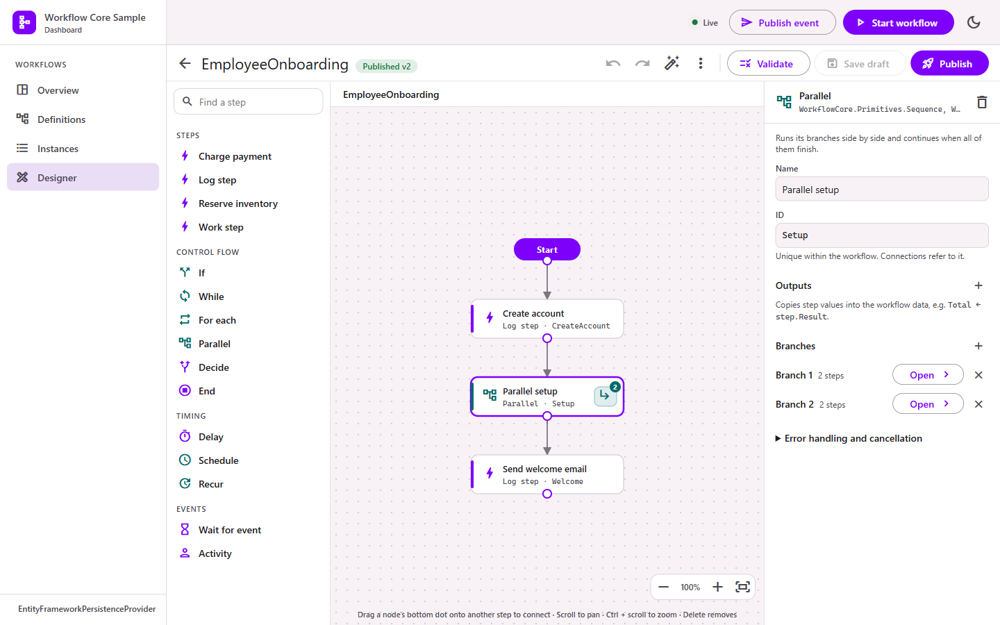

# Designer

The designer builds and edits workflows in Workflow Core's JSON/YAML format (the DSL loaded by `IDefinitionLoader`). What you publish is a normal Workflow Core definition: it is registered at once and can be exported to a file.



C# workflows are compiled code and stay view-only; their flowchart is on the definition page.

## Setup

```csharp
builder.Services.AddWorkflowCoreDashboard()
    .UseEntityFrameworkJournal(db => db.UseSqlServer(cs))   // keeps designs across restarts
    .AddDesigner();
```

The designer needs `AllowActions = true` (the default).

## Creating a workflow

1. Open **Designer** and choose **New workflow**.
2. Enter an ID (it identifies the workflow in Workflow Core; instances refer to it) and, optionally, the data type: the class that holds the workflow's data, written `Namespace.Type, Assembly`.
3. Add steps from the toolbox: click one to add it below the last step, or drag it onto the canvas.
4. Connect steps: drag from a step's bottom dot onto the next step. The **Start** marker points at the first step.
5. Select a step to fill in its inputs and outputs in the inspector.
6. **Validate**, then **Publish**.

Or **Import** an existing JSON or YAML definition to edit it.

## The toolbox

- **Your steps**: every public `StepBody` class in assemblies that reference Workflow Core, grouped by namespace. Add a `[Description("...")]` attribute to show a tooltip.
- **Control flow**: If, While, For each, Parallel, Decide, End.
- **Timing**: Delay, Schedule, Recur.
- **Events**: Wait for event, Activity.

A step type missing? Its assembly may not be loaded yet when the catalog is built. Add it with `designer.StepAssemblies.Add(typeof(MyStep).Assembly)`.

## Connections

| Connection | How | Stored as |
|---|---|---|
| Next step | Drag from a step's dot to another step | `NextStepId` |
| Conditional | Drag a second connection from the same step, then select it and write a condition | `SelectNextStep` |
| Start | Drag the Start marker's dot to a step | The step becomes first in the list |

Every connection whose condition is true is followed, so two true conditions run two paths at once. Conditions use `data` and, after a **Decide** step, `outcome` (the value of Decide's `Expression`). An empty condition means "always".

Select a connection and press Delete, or use **Remove connection**, to remove it.

## Containers and branches

If, While, For each, Parallel, Schedule and Recur run their **branches**. Open a branch with the button on the step, by double-clicking it, or from the inspector. Each branch is its own canvas; the breadcrumb at the top leads back.

- A branch runs from its first step; the steps after it must be connected.
- When all branches finish, the workflow continues with the container's next step.
- **Parallel** can have several branches (add them in the inspector); they run side by side.
- Inside **For each**, `context.Item` is the current item.

## Inputs and outputs

Inputs are Workflow Core expressions ([System.Linq.Dynamic.Core](https://dynamic-linq.net/) syntax):

| You want | Write |
|---|---|
| Text | `"Hello"` (with quotes) |
| A workflow data value | `data.OrderId` |
| Combined text | `"Order " + data.OrderId + " shipped"` |
| A number or flag | `42`, `true`, `data.Amount > 1000` |
| A time span | `TimeSpan.FromMinutes(5)` |
| Now | `DateTime.Now` |
| The For each item | `context.Item` |

Outputs copy step values into the workflow data: pick the data property on the left and write an expression over `step` on the right, e.g. `Shipment ← step.EventData`. The inspector suggests the step's outputs as chips.

## Validation

**Validate** checks the whole workflow:

- structure: unique IDs, known step types, connections to existing steps, inputs that exist on the step, outputs that exist on the data type;
- reachability: steps nothing leads to are warnings;
- expressions: a dry run of Workflow Core's own loader. Each step with a bad expression is flagged on the canvas.

Errors block publishing; warnings do not. The issues list links to each step.

## Drafts, publishing and versions

- **Save draft** (Ctrl+S) stores your work without registering it. **Discard draft** goes back to the latest published version.
- **Publish** validates, takes the next free version number (after any version already registered, including ones from code or files), registers it with Workflow Core so it can be started at once, and stores it.
- Published versions are immutable. Running instances keep using the version they started with.
- Every node registers stored versions at startup and checks for new ones every 30 seconds (`SyncInterval`).

## Keyboard

| Keys | Action |
|---|---|
| Delete / Backspace | Delete the selected step or connection |
| Ctrl+Z, Ctrl+Y (or Ctrl+Shift+Z) | Undo, redo |
| Ctrl+S | Save draft |
| Escape | Clear the selection |
| Scroll, Ctrl + scroll | Pan, zoom |

## Import and export

- **Import** accepts Workflow Core JSON or YAML, pasted or from a file. YAML type tags are refused for safety.
- **Export** (⋮ menu) downloads JSON or YAML that `IDefinitionLoader.LoadDefinition` loads unchanged.

## Limits

- Saga steps and compensation chains (`Saga`, `CompensateWith`) are kept on import and export but cannot be edited on the canvas.
- Inputs whose value is an object rather than an expression are kept and shown read-only.
- By default only types in the designer's catalog are accepted. See [Configuration](Configuration.md#designeroptions).
