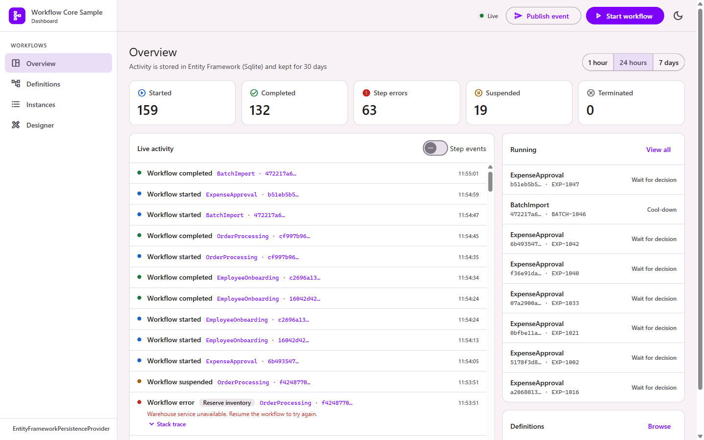

# Workflow Core Dashboard

An embeddable dashboard for [Workflow Core](https://github.com/danielgerlag/workflow-core): watch workflows run, inspect each instance as a flowchart, control them, and design JSON/YAML workflows in the browser.

## Start here

- [Getting started](Getting-Started.md): install the packages and open the dashboard.
- [Security](Security.md): read this before anyone else can reach the dashboard.

## Guides

- [Configuration](Configuration.md): every option, with defaults.
- [Activity journal](Activity-Journal.md): history that survives restarts, the instance index, retention, several nodes.
- [Workflow graph](Workflow-Graph.md): how flowcharts are drawn and what the colors mean.
- [Designer](Designer.md): building, validating and publishing JSON/YAML workflows.

## Reference

- [REST API](REST-API.md): the endpoints behind the UI.
- [Architecture](Architecture.md): how the pieces fit together.
- [Development](Development.md): building, testing and releasing the project.
- [FAQ](FAQ.md): common questions and problems.
